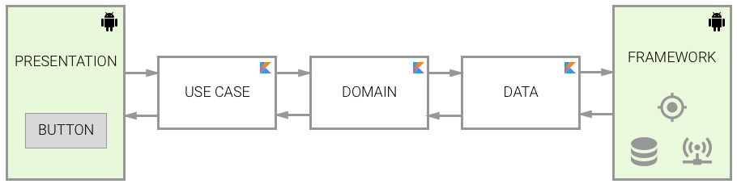
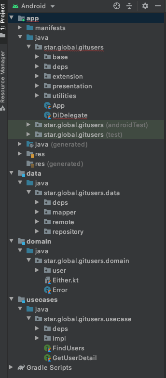

# Git Users Search

## Architecture

- 

- 

- 

This is a simple project, but it will be easy on scaling up

- The `domain`:
    * Only contains business models
- The `data`:
    * Provide data from repository:
        * Can get from remote source by using retrofit and map raw data model to business model
        * Or, get cached from local source if necessary
- The `usecase`:
    * Provide the interaction with `data` for `app` UI
- Main `app`:
    * Apply MVVM architecture
    * Apply Dependency Injection by using Dagger

## Code folder structure

- 
    * Contains 4 modules: `domain`, `usecase`, `data`, and main `app`
    * `app` contains:
        * `base`: define some base classes that will be extented in the application
        * `di`: define dependency injection with application scope
        * `extension`: define extensions will be used in the application
        * `presentation`: separate application into many features will make it be easy on scaling up
        * `utilities`: contains some utilities source code
## Framework, library and run
- Libraries/frameworks using in the application:
    *  Kotlin
    *  Coroutines
    *  Retrofit
    *  Dagger
    *  Mockito
- Required configurations:
    * AndroidSDK
    * Gradle 6.5
- Launch:
    * Windows
        * gradlew installRelease
    * MAC/Ubuntu
        * ./gradlew installRelease
## Check list:

1. ✅    Programming language: Kotlin is required, Java is optional. 
2. ✅    Design app's architecture: Clean architecture with MVVM
3. ✅    Apply LiveData mechanism
4. ✅    Write Unit Tests
5. ✅    Exception handling
6. Readme file includes:
* ✅ Brief explanation for the software development principles, patterns & practices being applied
* ✅ Brief explanation for the code folder structure and the key Java/Kotlin libraries and frameworks being used
* ✅ All the required steps in order to get the application run on local computer
* ✅ Check list of items the candidate has done.
